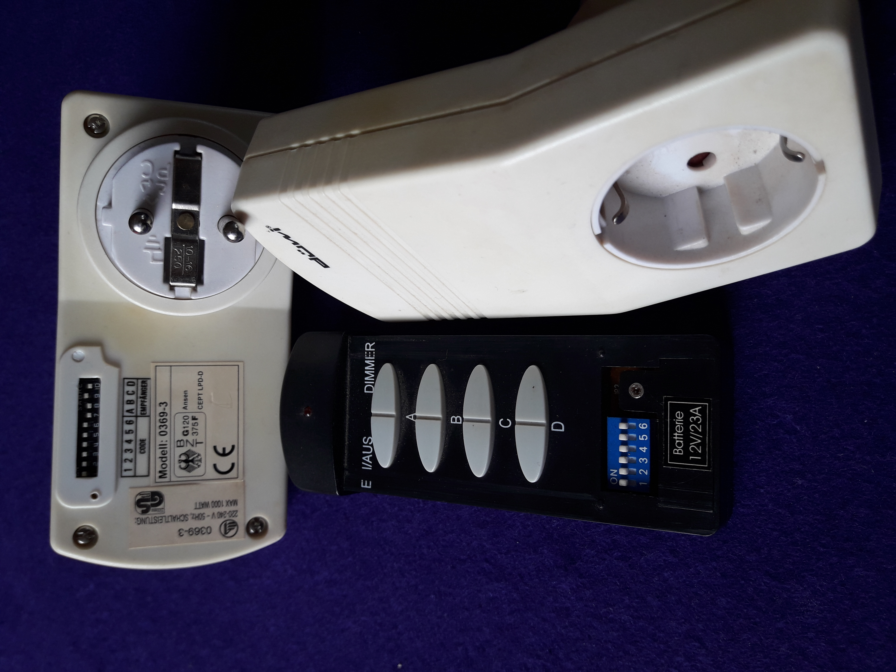
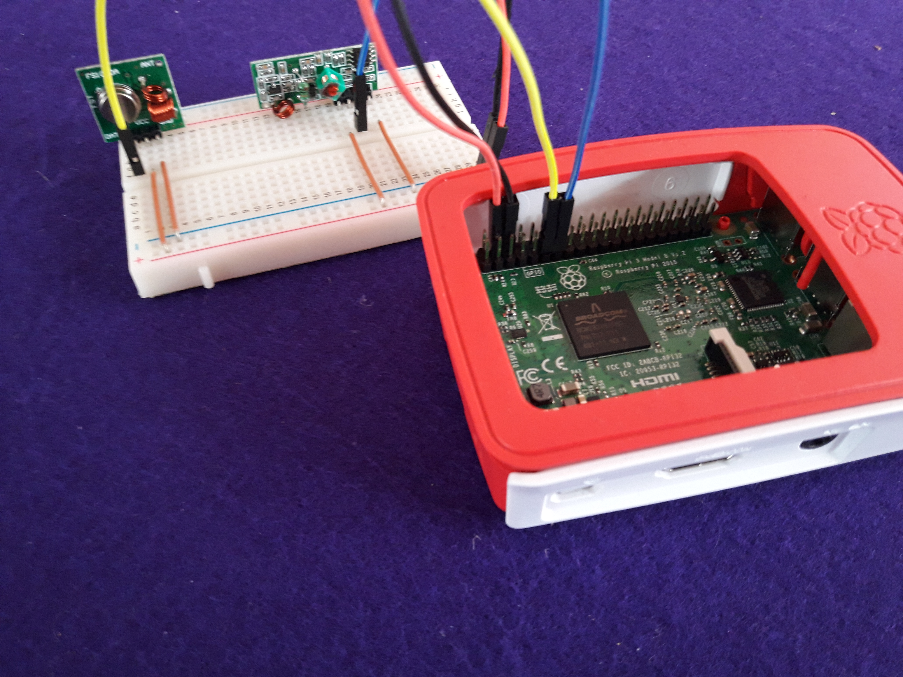
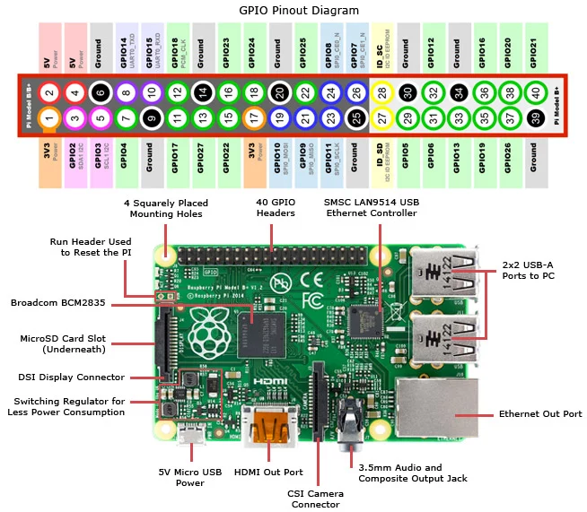

# SocketPi
SocketPi is my first project for the Raspberry Pi 3.
It uses a simple 433 MHz transmitter to switch some old radio controlled
sockets.

## Install Python Virtual Environment Dependencies
First, we want to work in a Python virtual environment:
```sh
sudo apt install python3-pip
sudo -H pip3 install virtualenv virtualenvwrapper
```

We add the following at the end of .bashrc:
```sh
export VIRTUALENVWRAPPER_PYTHON=/usr/bin/python3
export WORKON_HOME=~/PythonEnvs
source /usr/local/bin/virtualenvwrapper.sh
```

We create a virtual environment for our socket project, which we can
deactivate and later reenter with the helpers from virtualenvwrapper:
```sh
mkvirtualenv socket
deactivate
workon socket
```

The Python dependencies are installed by:
```sh
pip install -r requirements.txt
```
(This has to be executed while being inside the virtual environment.)

## Switching the Sockets

### The Sockets
The sockets are three [düwi](https://de.wikipedia.org/wiki/Düwi) model
0369-3.
They are controlled by a remote control with combined on/off buttons for
four sockets A to D (and additional dimmer buttons for all four sockets,
which are not used for this socket model).

The remote control and the sockets can be configured by DIP switches to a
common 6-bit house code.
The sockets additionally have 4-bit DIP switches to configure them to be
sockets A to D.

Remote control and two of the sockets are shown in the following image:


### Receiver and Transmitter
The 433 MHz receiver and transmitter were ordered from
[Aukru](https://aukru.com/en/home/39-aukru-3x-433-mhz-empfaenger-und-funk-sende-modul-einbrecher-alarm-433m-receiver-module.html).
They both simply have a 5V, a ground and a data connector.
The transmitter is connected to GPIO pin 17 and the receiver to GPIO pin 27
of the Pi.

The setup is shown in the following image:


The pinout of the Raspberry Pi is shown in the following image in detail:


### Controlling Receiver and Transmitter
We are using [rpi-rf](https://github.com/milaq/rpi-rf/), which in turn uses
[RPi.GPIO](https://sourceforge.net/projects/raspberry-gpio-python/) to
control the receiver and transmitter.

With the included script *rpi-rf_receive*, we can sniff the codes sent by
the remote control.
Our findings are summarised in the next section.

### Socket Codes
A 0 is encoded by 300 microsecond high signal followed by a 900 microsecond
low signal, while a 1 is encoded by a 900 microsecond high signal followed
by a 300 microsecond low signal.
In between the repetitions of the codes, a sync signal of 300 microsecond
high and 9300 microsecond low is sent.

The codes consist of 24 bits.
Every second bit is always 0, so that only the nibbles (4-bit blocks)
0000, 0001, 0100, and 0101 occur, corresponding to hexadecimal digits
0, 1, 4 and 5.

The first twelve bits, i.e., three hexadecimal digits contain the 6 bit
house code in the bits that are not always 0, where the up position of the
DIP switch corresponds to a 0, i.e., the position in the image above
corresponds to the hexadecimal digits 000, while the opposite (all DIP
switches down) would correspond to 555.

The next eight bits, i.e., two hexadecimal digits encode the socket:

| Socket | Bits     | Hexadecimal |
|--------|----------|-------------|
| A      | 00010101 | 15          |
| B      | 01000101 | 45          |
| C      | 01010100 | 54          |
| D      | 01010001 | 51          |

The last four bits are 0100 (hexadecimal 4) for on/off and 0001
(hexadecimal 1) for dimmer.

### Python Script to Switch Sockets
A small Python script, which sends the on/off codes to sockets A to D,
is implemented in socket_switch.py and can be executed by:
```sh
python socket_switch.py <socket>
```

## Web Interface
The sockets shall be controlled by a simple web interface created with
Python behind a Nginx web server.

### Install Python Web Development Dependencies
We install uWSGI (globally, outside of virtual environments):
```sh
sudo apt install python3-dev
sudo -H pip3 install uwsgi
```

And we install Nginx as a reverse proxy in front of uWSGI:
```sh
sudo apt install nginx-light
```

### Configure uWSGI and Nginx
The application resides in the *socket_app.py* script and should be mounted
at <http://localhost/socket>.

For uWSGI, we create the *socket_app.ini* uWSGI configuration file and a
*socket_app.service* systemd unit, which is linked from
*/etc/systemd/system/*, enabled and started:
```sh
sudo ln -s /home/pi/socket/socket_app.service /etc/systemd/system/
sudo systemctl enable socket_app.service
sudo systemctl start socket_app.service
```

For Nginx, we create the *socket_app.conf* Nginx configuration file, which
is linked from */etc/nginx/sites-available/* and enabled by a symlink in
*/etc/nginx/sites-enabled/* (while disabling the default site).
Finally, Nginx is restarted:
```sh
sudo ln -s /home/pi/socket/socket_app.conf /etc/nginx/sites-available/
sudo ln -s ../sites-available/socket_app.conf /etc/nginx/sites-enabled/
sudo rm /etc/nginx/sites-enabled/default
sudo systemctl restart nginx.service
```
