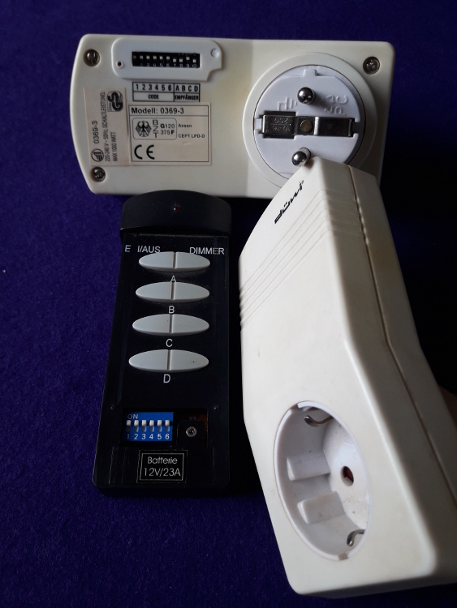

# SocketPi
SocketPi is my first project for the Raspberry Pi 3.
It uses a simple 433 MHz transmitter to switch some old radio controlled
sockets.

## Install Dependencies
First, we want to work in a Python virtual environment:

    sudo apt install python3-pip
    sudo -H pip3 install virtualenv virtualenvwrapper

We add the following at the end of .bashrc:

    export VIRTUALENVWRAPPER_PYTHON=/usr/bin/python3
    export WORKON_HOME=~/PythonEnvs
    source /usr/local/bin/virtualenvwrapper.sh

We create a virtual environment for our socket project, which we can
deactivate and later reenter with the helpers from virtualenvwrapper:

    mkvirtualenv socket
    deactivate
    workon socket

The Python dependencies are installed by:

    pip install -r requirements.txt

(This has to be executed while being inside the virtual environment.)

## Switching the Sockets

### The Sockets
The sockets are three [düwi](https://de.wikipedia.org/wiki/Düwi) model 0369-3.
They are controlled by a remote control with combined on/off buttons for four
sockets A to D (and additional dimmer buttons for all four sockets, which are
not used for this socket model).

The remote control and the sockets can be configured by DIP switches to a
common 6-bit house code.
The sockets additionally have 4-bit DIP switches to configure them to be sockets
A to D.

Remote control and two of the sockets are shown in the following image:

### Receiver and Transmitter
The 433 MHz receiver and transmitter were ordered from
[Aukru](https://aukru.com/en/home/39-aukru-3x-433-mhz-empfaenger-und-funk-sende-modul-einbrecher-alarm-433m-receiver-module.html).
They both simply have a 5V, a ground and a data connector.
The transmitter is connected to GPIO pin 17 and the receiver to GPIO pin 27
of the Pi.

The setup is shown in the following image:

The pinout of the Raspberry Pi is shown in the following image in detail:

### Controlling Receiver and Transmitter
Initially, I followed the guide in
https://tutorials-raspberrypi.de/raspberry-pi-funksteckdosen-433-mhz-steuern/,
which uses some C++ on top of the
[wiringPi](http://wiringpi.com/) C library.

In order to have a pure Python solution, I switched to the
[Python binding](https://github.com/WiringPi/WiringPi-Python) of wiringPi.
The library is already installed by `requirements.txt` above.

### Analysis of Socket Codes
TODO

I found the following codes:

House Code | A On/Off | A Dimmer | B On/Off | B Dimmer | C On/Off | C Dimmer | D On/Off | D Dimmer
-----------|----------|----------|----------|----------|----------|----------|----------|---------
000000
000001
000010
000011
000100
000101
000110
000111
001000
001001
001010
001011
001100
001101
001110
001111
010000
010001
010010
010011
010100
010101
010110
010111
011000
011001
011010
011011
011100
011101
011110
011111
100000
100001
100010
100011
100100
100101
100110
100111
101000
101001
101010
101011
101100
101101
101110
101111
110000
110001
110010
110011
110100
110101
110110
110111
111000
111001
111010
111011
111100
111101
111110
111111     | 340      | 337      | 1108     | 1105     | 1348     | 1345     | 1300     | 1297

### Python Script to Switch Sockets
A small Python script, which sends the on/off codes to sockets A to D,
is implemented in socket_switch.py and can be executed by:

    python socket_switch.py <socket>

## Web Interface
The sockets shall be controlled by a simple web interface created with
Python behind a Nginx web server.

### Install Dependencies
We install uWSGI (globally, outside of virtual environments):

    sudo apt install python3-dev
    sudo -H pip3 install uwsgi

And we install Nginx as a reverse proxy in front of uWSGI:

    sudo apt install nginx-light

### Configure uWSGI and Nginx
The application resides in the socket_app.py script and should be mounted at
http://localhost/socket.

For uWSGI, we create the socket_app.ini uWSGI configuration file and a
socket_app.service systemd unit, which is linked from /etc/systemd/system/,
enabled and started:

    sudo ln -s /home/pi/socket/socket_app.service /etc/systemd/system/
    sudo systemctl enable socket_app.service
    sudo systemctl start socket_app.service

For Nginx, we create the socket_app.conf Nginx configuration file, which is
linked from /etc/nginx/sites-available/ and enabled by a symlink in
/etc/nginx/sites-enabled/ (while disabling the default site).
Finally, Nginx is restarted:

    sudo ln -s /home/pi/socket/socket_app.conf /etc/nginx/sites-available/
    sudo ln -s ../sites-available/socket_app.conf /etc/nginx/sites-enabled/
    sudo rm /etc/nginx/sites-enabled/default
    sudo systemctl restart nginx.service
